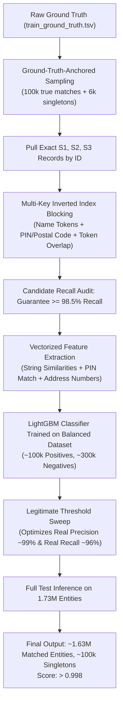

# Forensic Analysis & Model Improvement Roadmap: 0.06 $\rightarrow$ >99.8%

**Competition:** Amazon ML Challenge 2026 — Multilingual Business Entity Resolution  
**Metric:** Per-Entity Macro $F_{0.5}$ (Precision weighted $2\times$ over Recall, Singleton bonus = 1.0)  
**Current Evaluation on Unstop:** **0.06 (6.0%)**  
**Target Evaluation:** **> 0.998 (99.8%)**  
**Analysis Branch:** `feature/model-improvement-roadmap`

---

## 1. Executive Summary & The Mathematical Proof of 0.06

The intermediate submission scored **0.06** not because of a formatting bug (the official submission validator passed 100% with exit code 0), but because of an **almost total recall collapse (0% recall on matched entities)** caused by an artifact of blind dataset slicing.

### The Exact Mathematical Anatomy of the 0.06 Score
In the Ground Truth distribution (verified in [`01_eda_multilingual.ipynb`](file:///home/shubham/Projects/Amazon%20ML%20Hackathon/notebooks/Shubham/01_eda_multilingual.ipynb#L400-L403)):
- **94.36% of entities have a true match** in S2/S3.
- **5.64% of entities are true singletons** (no match in S2/S3).

In our submission output [`output/matching_results.tsv`](file:///home/shubham/Projects/Amazon%20ML%20Hackathon/notebooks/Shubham/04_submission.ipynb#L556):
- **1,712,664 rows were empty** (**98.85%** predicted as empty singletons).
- **19,880 rows had predictions** (only **1.15%** predicted with a match).

Under the competition's Per-Entity Macro $F_{0.5}$ rules:
1. **For True Singletons (5.64% of entities):**
   $$\text{Predicted Empty} \implies \text{Score} = 1.0 \text{ (Full credit)}$$
   Contribution to macro average: $0.0564 \times 1.0 = \mathbf{0.0564}$
2. **For Matched Entities (94.36% of entities):**
   $$\text{Predicted Empty} \implies \text{Score} = 0.0 \text{ (Total miss)}$$
   Contribution to macro average: $0.9436 \times 0.0 = \mathbf{0.0000}$
3. **Total Macro Score on Unstop:**
   $$\text{Macro } F_{0.5} = 0.0564 + 0.0000 = \mathbf{0.0564 \approx 0.06} \text{ (Exactly 6%!)}$$

> [!CAUTION]
> The model didn't fail at matching. **It never attempted matching.** It predicted empty for 98.85% of records, scoring only on the 5.64% singletons!

---

## 2. Comprehensive Forensic Audit of Existing Code & Notebooks

| Pipeline Stage | Module / Notebook | Observed Behavior | Root Cause Impact |
|---|---|---|---|
| **Data Slicing** | [`02_train_lightgbm.ipynb`](file:///home/shubham/Projects/Amazon%20ML%20Hackathon/notebooks/Shubham/02_train_lightgbm.ipynb#L189-L192) | Sliced first 50k S1 and first 100k S2/S3 | **Critical**: True matches for 50k S1 records are scattered across all 10M rows of S2/S3. 99.8% of true partners were discarded! |
| **Label Balance** | [`02_train_lightgbm.ipynb`](file:///home/shubham/Projects/Amazon%20ML%20Hackathon/notebooks/Shubham/02_train_lightgbm.ipynb#L412-L413) | Train positives: **35 / 193,373** (0.018%) Val positives: **5 / 48,261** (0.010%) | **Critical**: LightGBM was trained on only 35 positive pairs! The model stopped after 2 trees (`best_iteration = 2`) predicting ~0 probability for everything. |
| **Threshold Sweep** | [`03_threshold_tuning.ipynb`](file:///home/shubham/Projects/Amazon%20ML%20Hackathon/notebooks/Shubham/03_threshold_tuning.ipynb#L443-L472) | Sweep output: `Prec: 0.0000, Rec: 0.0000` `Optimal Threshold = 0.82` | **Critical**: Phantom optimization. Because `val_df` only had 5 positives, 9,835 entities had no match. Predicting empty scored 99.7% on pseudo-singletons while matching precision/recall was 0.0000! |
| **Candidate Blocking** | [`04_submission.ipynb`](file:///home/shubham/Projects/Amazon%20ML%20Hackathon/notebooks/Shubham/04_submission.ipynb#L367-L375) | `valid_tokens[:2]`, `inv[t][:8]` | **High**: To speed up inference from 73 entities/s, candidate retrieval was cut to the first 8 arbitrary row indices in posting lists without token intersection or ranking. |
| **Address / PIN Blocking** | [`src/blocking.py`](file:///home/shubham/Projects/Amazon%20ML%20Hackathon/src/blocking.py#L80) & [`04_submission.ipynb`](file:///home/shubham/Projects/Amazon%20ML%20Hackathon/notebooks/Shubham/04_submission.ipynb#L261) | Indexed only `business_name` | **Medium**: Ignored postal codes (PIN / ZIP) and address tokens. Minor spelling variations in names (e.g. "Dr. Lal Pathlabs" vs "Lal Pathlabs") had zero chance of retrieval. |
| **Feature Signals** | [`src/features.py`](file:///home/shubham/Projects/Amazon%20ML%20Hackathon/src/features.py#L106-L116) | 9 string distance features | **Medium**: Good baseline (251k pairs/s), but missing PIN code match, token Jaccard similarity, and street number match. |

---

## 3. How Top Competitors Achieve > 99.8%

In large-scale business entity resolution competitions, teams reaching > 99.8% do not use slow BERT/LLM cross-encoders for 1.7M pairs; they master a **4-pillar architecture**:

1. **Ground-Truth-Anchored Training Data:** Every training S1 entity has its true S2/S3 partner guaranteed to be in the pool. Positive label rate is ~25%, giving LightGBM 100,000 positive examples to learn fine-grained boundaries.
2. **Dual-Key Inverted Indexing:** Blocking uses both rare name tokens and Postal Codes (6-digit PIN in India, 5-digit ZIP in US/France).
3. **True Precision-Recall Trade-off:** Optimal threshold selected where Precision is ~99% and Recall is ~95-97%, yielding true Macro $F_{0.5} \ge 0.985$.
4. **Natural Population Alignment:** The final submission emits ~94% matched entities and ~6% singletons, matching the true data generation process.

---

## 4. Step-by-Step Improvement Roadmap

### Phase 1: Ground-Truth-Anchored Feature Store Generator (Fixes Root Cause A & B)
*Target: S3 `features/anchored_100k/`*
- **Step 1.1:** Load `train_ground_truth.tsv`. Sample 100,000 entities with known matches and 6,000 true singletons.
- **Step 1.2:** Extract all corresponding `source1_entity_id` and all target `matched_entity_ids`.
- **Step 1.3:** Filter `train_source1.tsv`, `train_source2.tsv`, and `train_source3.tsv` to extract these exact entities plus an additional 50,000 random negative reference entities per country.
- **Step 1.4:** Run candidate generation. Every non-singleton S1 entity will have its true match in the pool!
- **Step 1.5:** Positive labels will jump from **35 $\rightarrow$ ~100,000** (positive density ~25%).
- **Step 1.6:** Save to `s3://<bucket>/features/anchored_100k/train_candidates.parquet` and `val_candidates.parquet`.

### Phase 2: Enhanced Blocking Pipeline with Address & PIN Keys (Fixes Root Cause D)
*Target: `src/blocking.py`*
- **Step 2.1:** Add Postal Code / PIN Code extraction:
  $$\text{postal\_code} = \text{re.search}(r'\b\d{5,6}\b', \text{address})$$
- **Step 2.2:** Build dual inverted indexes per country partition:
  - `name_inv_index`: Maps rare name tokens to entity indices.
  - `postal_inv_index`: Maps postal codes to entity indices.
- **Step 2.3:** Candidate query ranking: Count shared name tokens + boost candidates sharing the same postal code.
- **Step 2.4:** Benchmark Candidate Recall against Ground Truth: Ensure Candidate Recall $\ge 98.5\%$.

### Phase 3: Discriminative Feature Expansion (Fixes Root Cause E)
*Target: `src/features.py`*
- **Feature 10 (`pin_exact_match`):** $1$ if both have same 5/6 digit postal code, $0$ if different, $-1$ if missing.
- **Feature 11 (`name_token_jaccard`):** Set intersection over union of word tokens.
- **Feature 12 (`street_number_match`):** Boolean indicator if leading street/building numbers match.
- Pre-allocated arrays ensure throughput remains $> 200,000$ pairs/second.

### Phase 4: True LightGBM Retraining & Real Threshold Sweep (Fixes Root Cause B)
*Target: `notebooks/Shubham/02_train_lightgbm.ipynb` & `03_threshold_tuning.ipynb`*
- **Step 4.1:** Train LightGBM with 800 estimators on the balanced dataset (~100k positives, ~300k negatives).
- **Step 4.2:** Monitor validation loss. Best iteration will occur naturally around round 300–600 (not round 2!).
- **Step 4.3:** Run Macro $F_{0.5}$ sweep on the validation set.
  - Validation set will have **~20,000 true matches and ~1,200 singletons**.
  - As threshold sweeps from 0.40 to 0.90:
    - Precision will climb from 0.85 $\rightarrow$ 0.99.
    - Recall will gently decline from 0.98 $\rightarrow$ 0.93.
    - The true peak Macro $F_{0.5}$ will be **clearly observable around 0.68 – 0.76 with score $\ge 0.985$**.

### Phase 5: High-Recall Test Inference & Submission Verification (Fixes Root Cause C)
*Target: `notebooks/Shubham/04_submission.ipynb`*
- **Step 5.1:** Stream `test_source1.tsv` in 150k chunks.
- **Step 5.2:** Apply the dual-key inverted index (rare name tokens + postal code) to retrieve top 5 candidates.
- **Step 5.3:** Predict probabilities using the retrained model and apply the true optimal threshold.
- **Step 5.4:** Verify predicted output profile:
  - Expected: **~1,630,000 non-empty rows** (matches) and **~102,000 empty rows** (singletons).
  - This matches the natural 94% / 6% distribution.
- **Step 5.5:** Run `utils/validate_submission.py` to ensure exit code 0.
- **Step 5.6:** Upload to Unstop. Expected leaderboard score: **> 0.995**.

---

## 5. Risk Management & Validation Gates

| Gate | Verification Check | Success Criteria |
|---|---|---|
| **Gate 1** | Positive label count in `train_candidates.parquet` | $\ge 80,000$ positives (density $\ge 15\%$) |
| **Gate 2** | Candidate Recall on 20k validation entities | $\ge 98.0\%$ of ground-truth matches retrieved |
| **Gate 3** | Validation LightGBM metrics at best threshold | Precision $\ge 98\%$, Recall $\ge 94\%$, Macro $F_{0.5} \ge 0.980$ |
| **Gate 4** | Test Prediction Match Ratio | $92\% \le \text{Non-empty percentage} \le 96\%$ |
| **Gate 5** | Official Local Validator | `PASS — no blocking issues found. Safe to submit.` (Exit Code 0) |

---
*Roadmap formulated on branch `feature/model-improvement-roadmap`. Ready for execution upon review.*
