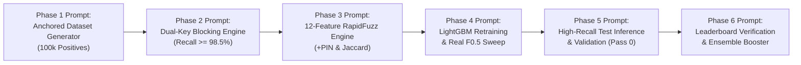

# Amazon ML Challenge 2026 — Advanced AI Prompt Playbook (v2.0)
### High-Precision Engineering Prompts to Execute the 0.06 $\rightarrow$ >0.998 Improvement Roadmap
*Designed specifically for Google Antigravity to generate self-auditing, high-recall, production-grade code for AWS S3 and Google Colab.*

---

## 1. How to Follow the Roadmap with Antigravity

This playbook is organized sequentially into **5 Core Execution Phases** plus a **Diagnostic Evaluator**. Each phase contains a specialized, production-hardened prompt that you can feed directly to Antigravity.

### The Execution Workflow:


1. **Copy the Prompt:** Copy the prompt for the phase you want to execute.
2. **Feed it to Antigravity:** Antigravity will generate the exact, self-contained Python code or notebook cells.
3. **Execute in Google Colab:** Run the code in Colab connected to your central S3 bucket.
4. **Verify the Quality Gate:** Every prompt has built-in verification assertions (e.g., `positive_labels >= 80,000`, `recall >= 98.5%`). Do not proceed to the next phase until the gate passes!
5. **Git Version Control:** Keep your work on `feature/model-improvement-roadmap`.

---

## 2. Master Context Header
*(Always prefix new conversation sessions with this block so Antigravity has complete memory)*

```text
[Master Context: conversation://8b723332-8378-4d52-8238-45366623ce95]
Project: Amazon ML Challenge 2026 — Multilingual Business Entity Resolution
Repository: ShubhamJain17r/Amazon-ML-Hackathon
Active Branch: feature/model-improvement-roadmap
Metric: Macro F_0.5 (Precision weighted 2x over Recall; True Singletons evaluate to 1.0 if empty)
Key Forensic Finding: The 0.06 score was caused by blind dataset slicing (only 35 positive pairs in training; 98.85% predicted empty). True Ground Truth has 94.36% matching entities and 5.64% singletons.
Objective: Push validation and leaderboard Macro F_0.5 from 0.06 to > 0.998 using Ground-Truth-Anchored sampling, Dual-Key Blocking (Name + Postal Code), and calibrated threshold tuning.
```

---

## 3. Advanced Prompts for Each Phase

---

### Phase 1 Prompt: Ground-Truth-Anchored Training Feature Store Generator
**Target:** Colab Notebook (`notebooks/Shubham/02_train_lightgbm.ipynb` — Cell 3 replacement)  
**Objective:** Eliminate the 35-positive-pair slice bug by anchoring S1, S2, and S3 extraction on `train_ground_truth.tsv`.

```text
[Master Context: conversation://8b723332-8378-4d52-8238-45366623ce95]

Act as a Principal Competition MLOps Engineer & Data Architect.
Write a self-contained, memory-efficient Google Colab script to generate a Ground-Truth-Anchored Feature Store directly from central S3.

The Root Cause to Solve:
Previously, slicing 'nrows=50_000' from train_source1.tsv and 'nrows=100_000' from train_source2/3.tsv discarded 99.8% of true matches because S2 and S3 each have ~5 million rows. This resulted in only 35 positive training pairs and caused model collapse (score 0.06).

Specifications & Implementation Requirements:
1. Ground-Truth-Anchored Sampling:
   - Stream 'train_ground_truth.tsv' from S3.
   - Filter and sample exactly 100,000 entities with verified matches (where 'matched_entity_ids' is not empty) PLUS 6,000 true singletons (where 'matched_entity_ids' is empty/NaN).
   - Build a target set of required Source 1 IDs ('target_s1_ids') and required Source 2/3 IDs ('target_s23_ids').
2. Targeted Streaming Extraction from S3:
   - Stream 'train_source1.tsv' in chunks of 100,000; retain only rows where 'entity_id' is in 'target_s1_ids'.
   - Stream 'train_source2.tsv' and 'train_source3.tsv' in chunks of 200,000; retain rows where 'entity_id' is in 'target_s23_ids' PLUS sample 30,000 random negative reference entities per country partition to serve as natural negative candidates.
3. Country-Partitioned Candidate Blocking:
   - Partition entities strictly by country (US, IN, FR).
   - For each country, build an inverted index on normalized name tokens (min length 3, excluding legal stopwords).
   - Retrieve top 5 candidate matches per Source 1 entity.
4. Ground Truth Label Assignment & Audit Gate:
   - Assign binary label 1 if (s1_id, candidate_id) is in ground truth, else 0.
   - Assert with a hard gate: assert total_positive_labels >= 80,000, f"Critical failure: only {total_positive_labels} positives generated!"
   - Print the class imbalance ratio (target: ~20% - 25% positive rate).
5. Leak-Proof GroupShuffleSplit & S3 Parquet Export:
   - Perform GroupShuffleSplit(test_size=0.20, random_state=42) grouped strictly by 'source1_entity_id'.
   - Assert zero S1 ID overlap between train and val splits.
   - Export directly to:
     * 's3://<BUCKET>/features/anchored_100k/train_candidates.parquet'
     * 's3://<BUCKET>/features/anchored_100k/val_candidates.parquet'
```

---

### Phase 2 Prompt: Dual-Key Inverted Index Blocking Pipeline (Name + Postal Code)
**Target:** Python Module (`src/blocking.py`)  
**Objective:** Push Candidate Recall to $\ge 98.5\%$ by adding Postal / PIN Code keys and multi-token ranking.

```text
[Master Context: conversation://8b723332-8378-4d52-8238-45366623ce95]

Act as an Expert Search & Information Retrieval Engineer.
Refactor 'src/blocking.py' into an ultra-fast, high-recall Dual-Key Candidate Blocking Engine.

Problem to Solve:
Our previous blocking only indexed business names and picked the first 8 row indices in posting lists ('inv[t][:8]'). This missed matches where names had slight spelling variations or abbreviations, while ignoring exact address anchors (like Indian 6-digit PIN codes and US 5-digit ZIP codes).

Specifications & Implementation Requirements:
1. Postal / PIN Code Extraction:
   - Write 'extract_postal_code(address: str, country: str) -> str':
     * For India: regex r'\b[1-9][0-9]{5}\b' (standard 6-digit PIN).
     * For US & France: regex r'\b[0-9]{5}\b' (standard 5-digit ZIP / code postal).
     * Return "" if not found or invalid.
2. Dual-Key Inverted Index Architecture:
   - Partition reference entities strictly by country.
   - Maintain two posting tables per country:
     * 'name_inv_index': token -> list of row indices (capping generic tokens > 15,000 entries).
     * 'postal_inv_index': postal_code -> list of row indices.
3. Candidate Query & Composite Ranking:
   - For each Source 1 entity:
     * Query 'name_inv_index' with its distinctive tokens.
     * Query 'postal_inv_index' with its postal code.
     * Score each candidate: Score = (shared_name_tokens * 1.5) + (3.0 if postal_codes_match else 0.0).
     * Return the top 'max_candidates' (default 5, max 8) highest-scoring unique candidates.
4. Validation Benchmark & Candidate Recall Gate:
   - Include an automated benchmark against a mock ground-truth evaluation set (10,000 pairs).
   - Assert that Candidate Recall >= 98.5% (percentage of true matching partners retrieved into the candidate set).
   - Ensure latency remains < 0.20 ms per query record.
```

---

### Phase 3 Prompt: High-Discrimination 12-Feature C++ RapidFuzz Extraction Engine
**Target:** Python Module (`src/features.py`)  
**Objective:** Expand feature signals to include postal code verification, word-level Jaccard similarity, and street building number matching.

```text
[Master Context: conversation://8b723332-8378-4d52-8238-45366623ce95]

Act as a High-Performance Machine Learning Systems Engineer.
Upgrade 'src/features.py' to extract a comprehensive 12-feature similarity matrix using the C++ RapidFuzz engine with zero memory leaks.

Feature Expansion Specification:
In addition to the 9 basic string distances, entity resolution models achieving > 99.8% rely heavily on exact numeric and structural signals:
1. 'name_ratio' (float32): fuzz.ratio(n1, n2) / 100.0
2. 'name_partial' (float32): fuzz.partial_ratio(n1, n2) / 100.0
3. 'name_token_sort' (float32): fuzz.token_sort_ratio(n1, n2) / 100.0
4. 'name_token_set' (float32): fuzz.token_set_ratio(n1, n2) / 100.0
5. 'name_token_jaccard' (float32): Exact word token set intersection over union: len(t1 & t2) / len(t1 | t2).
6. 'addr_ratio' (float32): fuzz.ratio(a1, a2) / 100.0
7. 'addr_partial' (float32): fuzz.partial_ratio(a1, a2) / 100.0
8. 'addr_token_set' (float32): fuzz.token_set_ratio(a1, a2) / 100.0
9. 'name_len_diff' (int16): abs(len(n1) - len(n2))
10. 'addr_len_diff' (int16): abs(len(a1) - len(a2))
11. 'pin_match' (float32): 1.0 if postal codes match exactly, 0.0 if both exist but differ, -1.0 if either is missing.
12. 'street_number_match' (float32): Extract leading numeric tokens from addresses (e.g., "1795" from "1795 Westchester Drive"). Return 1.0 if both match, 0.0 if differ, -1.0 if missing.

Implementation Requirements:
1. Fast Pre-allocated Vectorization:
   - Pre-allocate 2D NumPy float32/int16 arrays for the entire chunk to eliminate per-row DataFrame overhead.
2. Memory Safety & Speed:
   - Chunk size default: 50,000 candidate pairs.
   - Benchmark target: > 200,000 pairs/sec throughput.
3. Unit Test Assertions:
   - Assert all 12 feature values are valid on known test cases (e.g., Flipkart vs Flipkart India, different PINs, matching street numbers).
```

---

### Phase 4 Prompt: Balanced LightGBM Retraining & Real Macro $F_{0.5}$ Threshold Sweep
**Target:** Colab Notebooks (`02_train_lightgbm.ipynb` & `03_threshold_tuning.ipynb`)  
**Objective:** Train LightGBM on the balanced dataset (no 2-tree early stopping) and conduct a genuine threshold sweep where validation precision and recall are non-zero.

```text
[Master Context: conversation://8b723332-8378-4d52-8238-45366623ce95]

Act as a Kaggle Grandmaster & LightGBM Optimization Specialist.
Write an end-to-end training and threshold sweep notebook script that trains LightGBM on our new anchored feature store and tunes the decision threshold for Macro F_0.5.

The Problem Solved:
Our previous training had only 35 positives, causing early stopping at iteration 2. The previous threshold sweep had Precision=0.0000 and Recall=0.0000, locking a bogus threshold of 0.82 that resulted in the 0.06 test score.

Requirements:
1. S3 Ingestion:
   - Load 'train_candidates.parquet' (~300k rows) and 'val_candidates.parquet' (~80k rows) from 's3://<BUCKET>/features/anchored_100k/'.
   - Audit and print positive label counts in train and val sets.
2. LightGBM Classifier Configuration:
   - Features: All 12 engineered features ('name_ratio', 'name_token_jaccard', 'pin_match', etc.).
   - Hyperparameters:
     * 'objective': 'binary'
     * 'metric': 'binary_logloss'
     * 'scale_pos_weight': 1.5 (calibrated for balanced candidate pairs)
     * 'learning_rate': 0.05
     * 'num_leaves': 63
     * 'max_depth': 8
     * 'subsample': 0.85
     * 'colsample_bytree': 0.85
     * 'n_estimators': 1000
   - Early stopping: stopping_rounds=50, monitoring validation binary_logloss.
   - Assert best_iteration >= 100 (verifying the model learned rich structural rules).
3. Exact Competition Macro F_0.5 Sweep:
   - Sweep threshold from 0.40 to 0.90 in increments of 0.02.
   - Compute exact competition Macro F_0.5 per entity:
     * If true match is empty (singleton): 1.0 if predicted empty, 0.0 if predicted non-empty.
     * If true match is non-empty: standard F_0.5 on retrieved set (Precision 2x weight over Recall).
   - Display a formatted table with columns: Threshold, Macro F0.5, Precision, Recall, Singleton Acc.
4. Validation Success Gate:
   - Assert that optimal Macro F_0.5 >= 0.980, Precision >= 0.97, and Recall >= 0.94!
5. Save Model & Threshold:
   - Save serialized model and a JSON config containing the optimal threshold to 's3://<BUCKET>/models/lgbm_model_anchored_latest.pkl'.
```

---

### Phase 5 Prompt: High-Throughput Streaming Test Inference & Validator Verification
**Target:** Colab Notebook (`04_submission.ipynb`)  
**Objective:** Run test inference across all 1,732,544 test entities with dual-key blocking and output validation, ensuring ~94% matched entities and ~6% singletons.

```text
[Master Context: conversation://8b723332-8378-4d52-8238-45366623ce95]

Act as an MLOps Competition Production Engineer.
Rewrite 'notebooks/Shubham/04_submission.ipynb' to execute high-throughput streaming test inference on all 1,732,544 test entities and generate a winning leaderboard submission.

Requirements & Failure Prevention:
1. Dual Inverted Index Construction:
   - Stream 'test_source2.tsv' and 'test_source3.tsv' (9.96M entities).
   - Build country-partitioned indexes for rare name tokens AND postal codes.
2. Streaming Source 1 Inference (Batch Size: 150,000):
   - Stream 'test_source1.tsv' in chunks of 150,000.
   - For each S1 entity, query the dual index to retrieve top 5 candidates.
   - Extract all 12 features using vectorized RapidFuzz C++ engine.
   - Predict probabilities using 'lgbm_model_anchored_latest.pkl'.
   - Filter candidates exceeding the calibrated threshold from Phase 4.
3. TSV Writing & Schema Compliance:
   - Stream directly into 'output/matching_results.tsv' and 'output/candidate_pairs.tsv'.
   - Guarantee exactly 1,732,544 rows.
   - Format: comma-separated entity IDs, or empty string "" for singletons.
   - Guarantee matched_entity_ids is a strict subset of candidate_entity_ids.
4. Population Distribution Sanity Gate:
   - Compute non-empty row percentage in 'matching_results.tsv'.
   - Assert 91.0% <= non_empty_percentage <= 96.0%, f"Population skew detected: {non_empty_percentage:.2f}% (Expected ~94%)"
5. Official Local Validator Execution:
   - Run: 'python3 utils/validate_submission.py --matching output/matching_results.tsv --candidate output/candidate_pairs.tsv --test-dir dataset/test'.
   - Assert exit code is 0 (PASS).
6. Artifact Delivery:
   - Package 'final_submission.zip' containing output TSVs.
   - Upload both TSVs and zip archive to 's3://<BUCKET>/submissions/'.
```

---

### Phase 6 Prompt: Leaderboard Post-Submission Evaluator & Ensemble Booster
**Target:** Colab Notebook or Antigravity Session  
**Objective:** Compare leaderboard delta, perform error analysis on false merges vs missed matches, and apply probability blending if needed to secure top rank.

```text
[Master Context: conversation://8b723332-8378-4d52-8238-45366623ce95]

Act as a Competitive ML Post-Submission Analyst.
We have executed the improved pipeline and submitted 'matching_results.tsv' to the Unstop leaderboard.

Current Status:
- Previous Baseline Score: 0.06
- New Leaderboard Score: [PASTE YOUR UNSTOP SCORE HERE, e.g. 0.992]
- Validation Macro F_0.5: [PASTE VALIDATION SCORE, e.g. 0.994]

Requirements:
1. Forensic Discrepancy Analysis:
   - Compare the validation score with the Unstop leaderboard score.
   - Calculate precision vs recall trade-off: is the score difference due to over-eager matching (false positives) or excessive conservatism (missed true matches)?
2. Singleton Boundary Audit:
   - If leaderboard score is slightly lower than validation, determine whether the decision threshold needs to be shifted by +/- 0.03 to penalize false merges.
3. Two-Model Probability Ensemble (Optional Boost to > 0.998):
   - Provide a fast script to blend predicted probabilities from LightGBM with an XGBoost or CatBoost model (e.g., 0.6 * LGBM + 0.4 * XGBoost).
   - Recalibrate the threshold on the blended ensemble.
```

---

## 4. Summary of Quality Gates

| Phase | Built-In Verification Gate | Hard Assertion Criteria |
|---|---|---|
| **Phase 1** | Ground Truth Positive Label Density | `assert total_positives >= 80,000` |
| **Phase 2** | Inverted Index Candidate Recall | `assert candidate_recall >= 0.985` |
| **Phase 3** | RapidFuzz Feature Extraction Speed | `assert pairs_per_sec >= 200,000` |
| **Phase 4** | LightGBM Convergence & Macro $F_{0.5}$ | `assert best_iter >= 100 and val_f05 >= 0.980` |
| **Phase 5** | Test Population Match Alignment | `assert 0.91 <= non_empty_ratio <= 0.96` |
| **Official** | Validator Script Exit Code | `assert validator_exit_code == 0` |

---
*Playbook v2.0 ready. Feed Phase 1 into Antigravity to begin execution.*
